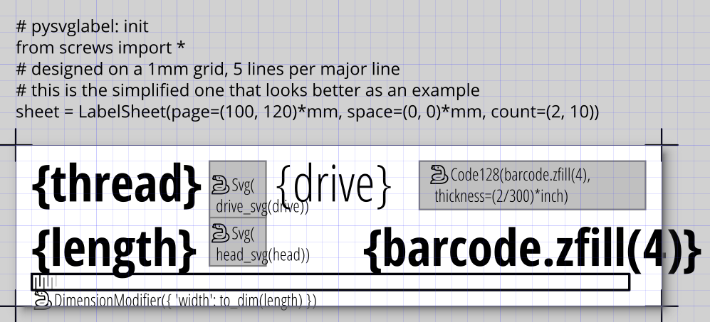
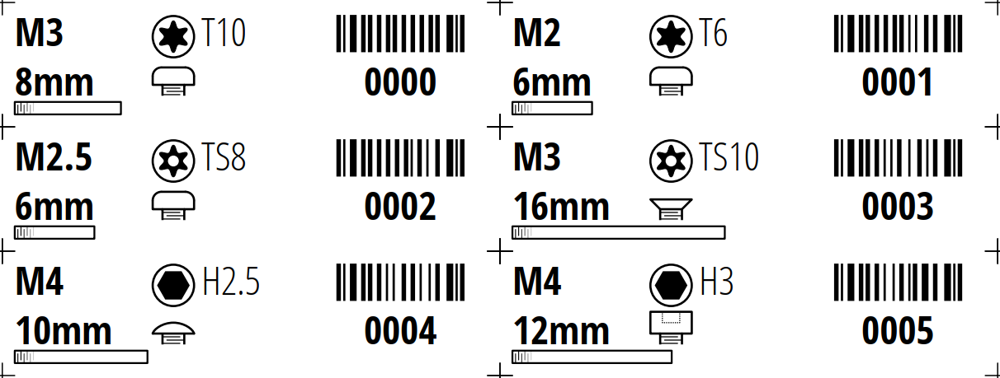

# pysvglabel

Label generator with SVG templates supporting embedded Python code and CSV data

| Template | Output |
|:---:|:---:|
|  <br/> [source SVG](examples/screws_40x10mm_simple.svg) <br/> with [supporting code](examples/screws.py) |  <br/> from [data CSV](examples/screws.csv) |

## Usage

Install:
`pip install pysvglabel`

To generate a sheet of labels from a template file and csv, run:
`python -m pysvglabel.generate <template.svg> <data.csv> <output.svg | output.pdf>`

Additional options (see command help for details):
- generate (Inkscape nonstandard) multi-page SVGs
- send to printer (Windows only)

If PDF output is requested, Inkscape is used as the renderer and must be installed and on your system PATH.

Label sheet data is embedded in the template .svg file.
All text in the .svg file are treated as Python f-strings, and the contents of the row (where the column name is a legal Python variable name) are made available. 
Specially formatted commands (see [Template Reference](#template-reference)) that call Python functions (such as generating barcodes) can also be written into the template.

**Security notes**: running the labelmaker can execute arbitrary Python code embedded in the template SVG and supporting scripts.
There should be no issues if you're designing your own template from scratch.
Treat templates from the internet as you might treat a document with macros - make sure you trust it before running it.
Not all embedded Python code may be visible graphical elements.

### Windows Live Printing

The live printing utility watches for changes in a .csv file and prints changed rows.
This is useful for single label printers (as opposed to sheets), like a thermal printer.

This needs a few more dependencies:
`pip install pysvglabel[printing]`

Inkscape must be installed and on your system PATH.

Run
`python -m pysvglabel.printer <"ZDesigner GX430t"> <template.svg> <data.csv>`

### API

The SVG templating engine can be used in other Python code with the `SvgTempalte` class.

```python
from pysvglabel import SvgTemplate
import xml.etree.ElementTree as ET

template = SvgTemplate("template.svg")
# create the blank sheet
sheet = template.create_sheet()
# instantiate a page of labels and append to the sheet, with values specified as a list of dicts, one per label
sheet.append(template.apply_page([
  {'title': 'cat', 'barcode': '0000'},
  {'title': 'duck', 'barcode': '0001'},
]))

# ... which can be written out
ET.tostring(sheet, 'utf-8')

# ... or rendered to PNG
import cairosvg
cairosvg.svg2png(bytestring=ET.tostring(sheet, 'utf-8'))
```

## Template Reference

### Control Block
The control block is a textbox starting with `# pysvglabel: init`
This is interpreted as a block of Python code, executed for each template.
Variables and imports are available to code running per label instance. 

It must define the `sheet` as a `LabelSheet` object, for example `sheet = LabelSheet(page=(40, 10)*mm, space=(0, 0)*mm, count=(1, 1))`

### Labels

For each label instance, the CSV data is made available as local variables of the column name.

All text is interpreted as f-strings, use `{}` to substitute in variable values.

### Rectangular Area Generators

These are defined as a rectangle (specifying the area) and a textbox (with the Python code, starting with the snake emoji `🐍`) in a group.

Barcodes:
- `Code128(self, data: str, thickness: LengthDimension, quiet: bool = True, align: Align = Align.CENTER, fill: str = '#000000')`: code 128 linear barcode generator, a general-purpose barcode
- `QrCode(data: str, size: LengthDimension, align: Align = Align.CENTER, fill: str = '#000000', border: Optional[int] = None, error_correction: Optional[int] = None)`: QR code generator
- `DataMatrix(data: str, size: LengthDimension, align: Align = Align.CENTER, fill: str = '#000000')`: datamatrix 2d barcode generator

Sub-elements:
- `Svg(filename: Optional[str], scaling: Scaling = Scaling.FIT, align: Align = Align.CENTER)`: include a SVG, with the filename relative to the template SVG's path.
  If filename is `None`, this is ignored.
- `Subtemplate(filename: Optional[str], env: Dict[str, Any], scaling: Scaling = Scaling.FIT, align: Align = Align.CENTER)`: include a template SVG file, applying the templating engine to it.

### Modifiers

These are defined as some elements and a textbox (with the Python code, starting with the snake emoji `🐍`) in a group.

- `Hide(cond: bool)`: if `cond` is true, hides the elements
- `StyleModifier(attribs: Dict[str, str])`: sets the argument style attributes of all elements in the group.
- `FillColor(color: str)`, `StrokeColor(color: str)`: sets the fill / stroke color of all elements in the group.
  Alpha value (if specified as `#rrggbbaa`) is mapped to `fill-opacity` / `stroke-opacity`.
- `DimensionModifier(set: Dict[str, LengthDimension], add: Dict[str, LengthDimension] = {})`: sets or adds attributes of all elements in the group.
